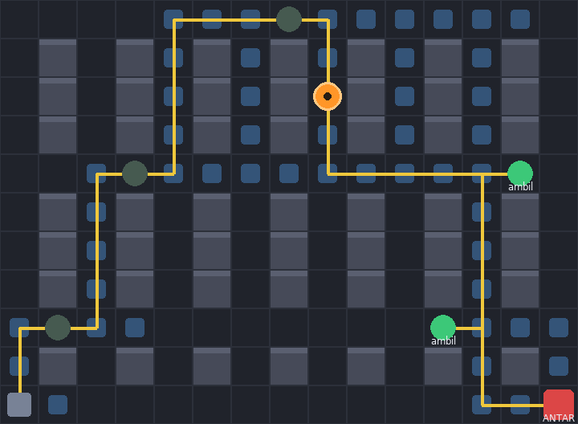

# WarehouseBot — Simulasi Robot Pengantar Barang Otonom di Gudang (A\*)


> Robot gudang otonom yang merencanakan urutan pengambilan barang dan mencari
> jalur optimal antar titik dengan algoritma **A\***, lalu mengeksekusinya dalam
> simulasi visual real-time. Proyek demonstrasi *searching & planning* untuk
> robotika gudang.

Projek Akhir Artificial Intelligence 2026 — kategori **AI untuk Searching & Planning / Robotics**.

Sebuah robot gudang otonom bertugas mengambil beberapa barang dari rak lalu
mengantarnya ke titik *packing*. Robot merencanakan urutan kunjungan dan mencari
jalur paling optimal menggunakan algoritma **A\* (A-Star)**, lalu mengeksekusinya
dalam simulasi visual (Pygame).



## Alur AI

```
INPUT                    PLANNING                         OUTPUT
peta gudang (grid)  -->  urutan kunjungan (greedy NN) -->  rute optimal
daftar order             + jalur tiap segmen (A*)          + animasi gerak robot
                                                           + metrik (jarak, node)
```

## Struktur File

| File             | Isi                                                            |
|------------------|---------------------------------------------------------------|
| `astar.py`       | Algoritma A\* + heuristik Manhattan (inti AI).                 |
| `warehouse.py`   | Peta gudang + perencana misi (greedy nearest-neighbor).       |
| `main.py`        | Simulasi & visualisasi Pygame.                                |
| `requirements.txt` | Dependensi (`pygame-ce`).                                    |
| `test_simulation.py` | Uji otomatis logika A\* & perencana misi (headless).       |

## Persyaratan

- **Python 3.8 – 3.14** (cek dengan `python --version`).
- Sistem operasi apa saja (Windows / macOS / Linux). Dependensi visual
  (`pygame-ce`) terpasang otomatis dari wheel siap pakai, tidak perlu compiler.

## Cara Menjalankan

**1. Clone repository**

```bash
git clone https://github.com/nothinx/robot-gudang.git
cd robot-gudang
```

**2. Buat virtual environment & aktifkan**

Windows (PowerShell):
```powershell
python -m venv .venv
.\.venv\Scripts\Activate.ps1
```

macOS / Linux:
```bash
python3 -m venv .venv
source .venv/bin/activate
```

**3. Install dependensi**

```bash
pip install -r requirements.txt
```

**4. Jalankan simulasi** (membuka jendela grafis)

```bash
python main.py
```

**5. (Opsional) Jalankan pengujian otomatis** — headless, tanpa jendela:

```bash
python test_simulation.py
```
Output yang diharapkan diakhiri dengan `ALL TESTS PASSED`.

## Troubleshooting

| Gejala | Solusi |
|--------|--------|
| `pip install` gagal build `pygame` | Repo ini memakai `pygame-ce` (bukan `pygame`) justru untuk menghindari ini. Pastikan `requirements.txt` belum diubah, lalu `pip install -U pip` dan ulangi. |
| `python` tidak dikenali | Gunakan `python3` (macOS/Linux) atau install Python dari [python.org](https://www.python.org/downloads/) dan centang *Add to PATH* (Windows). |
| Jendela tidak muncul / butuh tampilan grafis | `main.py` butuh layar (GUI). Di server tanpa display, jalankan `test_simulation.py` untuk memverifikasi logika AI. |

## Kontrol

| Tombol  | Fungsi                              |
|---------|-------------------------------------|
| `SPASI` | Jeda / lanjut animasi               |
| `R`     | Acak ulang lokasi barang & jalankan |
| `ESC` / `Q` | Keluar                          |

## Keterangan Visual

- **Kotak abu tua** — rak (obstacle, tidak bisa dilewati).
- **Sel biru muda** — node yang dieksplorasi A\* (cara AI "berpikir").
- **Garis kuning** — jalur optimal yang dipilih.
- **Lingkaran hijau** — titik AMBIL barang.
- **Kotak merah** — titik ANTAR (packing station).
- **Lingkaran oranye** — robot.

## Algoritma A\*

`f(n) = g(n) + h(n)`, dengan `g(n)` = biaya nyata dari titik awal dan
`h(n)` = jarak Manhattan ke tujuan. Karena heuristik Manhattan *admissible*
pada grid gerak 4-arah, A\* dijamin menemukan jalur **paling optimal**
(complete & optimal) sekaligus lebih efisien daripada BFS/Dijkstra karena
pencariannya terarah ke tujuan.

## Evaluasi Keberhasilan

- **Optimalitas** — panjang jalur sama dengan jalur terpendek sebenarnya.
- **Efisiensi** — jumlah node yang dieksplorasi (lebih sedikit = lebih baik).
- **Kelengkapan misi** — seluruh barang berhasil diambil & diantar.
- **Robustness** — tetap menemukan jalur untuk konfigurasi barang acak (tombol `R`).
